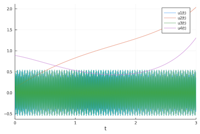

# Summary

Highly oscillatory ordinary differential equations (ODEs) have a
long history since they are ubiquitous  to describe dynamical
multi-scale physical phenomena in physics or chemistry. They can
be obtained by an appropriate spatial discretization of partial
differential equations or can directly describe the behavior of
dynamical quantities.  In addition to the standard difficulties
relating to their numerical resolution, highly oscillatory ODEs involve
a stiffness (characterized by a parameter $\varepsilon\in \, ]0, 1]$) 
which gives rise to high oscillations in the solution.  Hence, to capture
these small scales (or high oscillations), conventional methods
have to consider a time step smaller than $\varepsilon$ leading to
unacceptable computational cost.

We present here `HOODESolver.jl`[^1], a general-purpose library
written in Julia dedicated to the efficient resolution of highly
oscillatory ODEs.  In the documentation [^2] details are given to
explain how to simulate highly oscillatory ODEs using a Uniformly
Accurate (UA) method *ie* a method which is able to capture the solution
while keeping the time step (and then the computational cost)
independent of the degree of stiffness $\varepsilon$.

[^1]: https://github.com/ymocquar/HOODESolver.jl
[^2]: https://ymocquar.github.io/HOODESolver.jl/stable/

# Statement of need

The Julia package `DifferentialEquations.jl`
[@rackauckas2017differentialequations] efficiently solves many ODE
problems using recent and advanced numerical techniques. However
the available algorithms do not easily solve the stiff problems 
discussed above, because they do not take into account the highly oscillatory
character of the solutions. Indeed, the solution presents oscillations
whose period is proportional to $\varepsilon$.  If $\varepsilon$
is small, conventional methods struggle to solve such multi-scale
phenomena since they require to use tiny time steps to capture high
oscillations and become computationally very costly.  On the one
side, specific methods inspired by the averaging theory have been
designed to deal with the regime $\varepsilon \ll 1$. On the other
side, when $\varepsilon \sim 1$ the problem ceases to be stiff and
a classical integrator gives accurate result in reasonable time.
The true difficulty emerges for intermediate values of $\varepsilon$,
for which averaging techniques are not accurate enough and, due to
computational cost, standard methods are inefficient. Thus, a new
paradigm has been recently introduced, the so-called
uniformly accurate (UA) methods which are indeed able to solve the original
highly oscillatory problem with a precision and a computational
cost that are independent of the value $\varepsilon$.  In particular,
these methods allows skipping several oscillations per time
step, reducing the number of iterations (and then the cost of the
simulation) drastically.


`HOODESolver.jl` intends to gather and unify recent research around
highly oscillatory problems [@bao_zhao; @vlasov_pic1; @vlasov_pic2;
@numer_math]; its development has been motivated by these research
needs and it has already been used in some papers [@derivative_free].
`HOODESolver.jl` provides software implementations of several
theoretical ideas contained in the recent literature around the
so-called *two-scale* method. In particular, a very recent extension
proposed in [@derivative_free] enables to reach high order accuracy.
The implementation focuses on a multistep method (namely Adams-Bashforth
method) coupled with a spectral method for the discretization of
the additional variable representing the fast scale.  Hence,
`HOODESolver.jl` provides an efficient way for researchers to solve
a highly oscillatory ODE system, and as such it can be used by the
scientific community:

- researchers interested in solving highly oscillatory problems arising in their research field (electromagnetic waves, quantum mechanics, plasma physics, molecular dynamics, $\dots$), 
- it can guide some future potential numerical or theoretical developments, 
- it will serve as a reference to benchmark a new method designed by researchers.  

# Features 
 
`HOODESolver.jl` is designed to solve the following highly oscillatory ordinary differential system 

\begin{equation}\label{orig}
\dot{u}(t) = \frac{1}{\varepsilon} A u(t) + f(t, u), \qquad t\in [t_{start}, t_{end}],  
\qquad u(t=t_{start}) = u_{in},
\end{equation}

where 

- $u \colon t \in [t_{start}, t_{end}] \mapsto  u(t) \in \mathbb{R}^n, \qquad t_{start}, t_{end}\in \mathbb{R}$.
- $u_{in}\in \mathbb{R}^n$, 
- $A\in {\cal M}_{n,n}(\mathbb{R})$ such that $\tau \mapsto \exp(\tau A)$ is $2\pi$-periodic,  
- $f \colon (t,u) \in \mathbb{R} \times \mathbb{R}^n   \mapsto f(t,u) \in \mathbb{R}^n$.

The numerical solution of \autoref{orig} is computed by simply
entering the different components of the equation ($A$, $f$,
$\varepsilon$, $t_{start}, t_{end}$, $u_{in}$) following the required
format.  The user simply chooses an order ``order`` of the Adams-Bashforth 
time integrator and the time step ``h`` $= (t_{start}-t_{end})/$``nb_t``. 
The result is given as a function
object which can be evaluated in an arbitrary time $t$, not just
at the discrete times. In addition to the methodology
introduced in `HOODESolver.jl`, the package includes:

1. Arbitrary precision arithmetic via BigFloats,
2. New technique to compute the first iterations required for the initialization of the Adams-Bashforth method, this requires that $f$ has to be `order` times differentiable on $[t_{start}-$ `order` $h, t_{end}]$,    
3. Extension of the two-scale method to non-homogeneous problems.  

The package has been thought to be in close connection to
`DifferentialEquation.jl`.  We offer a common interface
with it by extending the `SplitODE` problem type[^4]. Users
can use our package more easily and it facilitates the cross
comparisons with other methods.

The function `LinearHOODEOperator` has been written following the interface `AbstractDiffEqLinearOperator`[^5] in order to solve a `SplitODEProblem` using the `HOODEAB` algorithm. It defines the stiff operator $\frac{1}{\varepsilon} A$ with both $\varepsilon$ and $A$ from the studied \autoref{orig}.

[^5]: https://diffeq.sciml.ai/stable/features/diffeq_operator/#DiffEqOperators

# Example

The following is an example with the system of Hénon-Heiles[^3]:

[^3]: https://ymocquar.github.io/HOODESolver.jl/stable/quickstart/

```julia
using HOODESolver, Plots

epsilon = 0.0001

A = [ 0 0 1 0 ; 
      0 0 0 0 ; 
     -1 0 0 0 ; 
      0 0 0 0 ]

f1 = LinearHOODEOperator( epsilon, A)

f2 = (u,p,t) ->  [ 0, u[4], 2*u[1]*u[2], -u[2] - u[1]^2 + u[2]^2 ] 

tspan = (0.0, 3.0)
u0 = [0.55, 0.12, 0.03, 0.89]
prob = SplitODEProblem(f1, f2, u0, tspan); 

sol = solve(prob, HOODEAB()) 
plot(sol) 
```
{ width=50% }

# Related research and software 

The development of the `HOODESolver.jl` package was initially motivated
by the need of efficient multiscale solvers for the charged particles
dynamics in an external strong magnetic field. Indeed, due to the
Lorentz force, charged particles undergo rapid circular motion
around the magnetic field lines. This constitutes the basis of the
magnetic confinement of a plasma in a chamber. Obviously, computing
a highly oscillatory dynamics is a long-standing problem occurring
in many relevant applications [@hairer_lubich_wanner; @engquist].
However, we are not aware of other software packages with similar
purpose, excepting the very recent (py)oscode package [@joss_ode]
which combines WKB techniques and standard integration methods to
ensure a user-specified tolerance.

[^4]: https://diffeq.sciml.ai/stable/types/split_ode_types/

# Aknowledgements

Much of `HOODESolver.jl` was implemented by Y. Mocquard
while he was supported by Inria through the AdT (Aide au développement
technologique) J-Plaff of the center Rennes-Bretagne Atlantique.

# References
